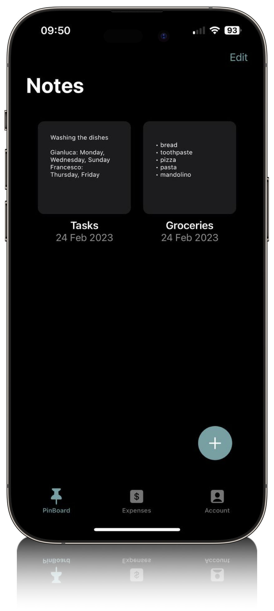
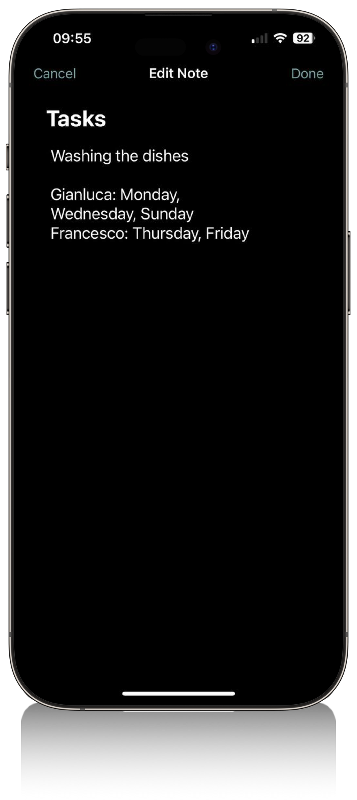
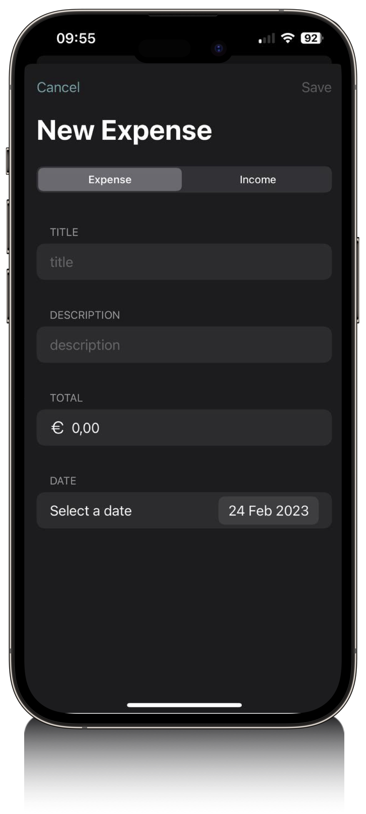

# 🤌 Raffaele Lungarella<a href='https://www.linkedin.com/public-profile/settings?trk=d_flagship3_profile_self_view_public_profile'><a href='https://lungarella.artstation.com'>
          

~~~
Digital Craftsman (Developer, Designer)
~~~

I'm a student who has a deep passion for blending programming with art and design. Front-end development holds a special place in my heart, but I also enjoy diving into back-end programming. Right now, I don't have a specific path in mind—I'm simply eager to experiment and soak up as much knowledge as I can.

---

### 🛠️ Programming Tools

 

  
 

 

### 🧑‍💻 Software Knowledge

   

  
 

 

---

## ***Some of my Coding Projects***

<h3>  Flatmate</h3>

>Flatmate is a mobile application that allows you to manage the expenses of a shared apartment. It is possible to create a group, add expenses and view statistics on the expenses of the group. The application is developed in SwiftUI and uses Firebase as a database. The application is developed only for iOS.

 

 

 

 

<h3>  Better Call Nanny</h3>

>Better Call Nanny was a website developed by a team of four university students, including myself. The objective of the project was to create a user-friendly platform for scheduling and booking babysitters. To build the site, we utilized HTML, CSS, and JavaScript, making sure to adhere to the project's limitations by not incorporating any external libraries or APIs. For the database, we implemented PostgreSQL.

